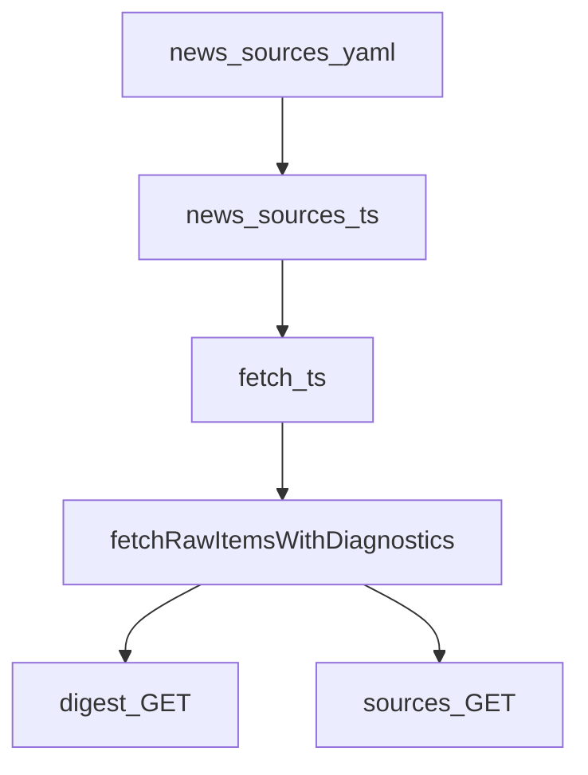

# Configurable news sources (YAML) + debug endpoint

## Goal

- Replace hardcoded `[RSS_FEEDS](apps/web/src/lib/pipeline/fetch.ts)` and X constants with `**apps/web/src/lib/config/news-sources.yaml**`.
- Per-source `**enabled**` toggles (e.g. X-only when Reuters is flaky).
- **Per-source diagnostics** (duration, item count, error) for logs and for the debug API.
- **Debug endpoint** runs **fetch only** (no embeddings / summarize / classify / upsert), guarded like the digest cron.

## 1. YAML schema (`news-sources.yaml`)

Top-level `sources:` array. Discriminated by `type`:

**RSS**

- `id` (stable string, e.g. `reuters-top`)
- `type: rss`
- `enabled` (boolean)
- `url`, `label` (→ `RawItem.source`)
- optional `region` (must match `[Region](apps/web/src/lib/types/digest.ts)`)

**X**

- `id` (e.g. `x-search`)
- `type: x`
- `enabled`
- `query` (full search string)
- `max_results` (default 20)
- `since_days` (default 1, match current “yesterday UTC” window)

**Initial content:** Encode today’s feeds and X query from `[fetch.ts](apps/web/src/lib/pipeline/fetch.ts)` so all `enabled: true` preserves current behavior.

## 2. Loader (`news-sources.ts`)

- Path: `[apps/web/src/lib/config/news-sources.ts](apps/web/src/lib/config/news-sources.ts)` (same pattern as `[buckets.ts](apps/web/src/lib/config/buckets.ts)`: `fs` + `yaml` parse, `process.cwd()` + `src/lib/config/...`).
- Export typed `NewsSource` union and `getNewsSources(): NewsSource[]` (parse once at module load).
- **Validation:** reject unknown `type`, missing required fields; throw with clear message at startup.
- **All disabled / empty list:** valid; fetch returns zero items (RFC-001 zero-items behavior).

## 3. Refactor `[fetch.ts](apps/web/src/lib/pipeline/fetch.ts)`

- Iterate **enabled** sources only.
- RSS: keep existing `Promise.allSettled` pattern per feed (timeout, XML parse, `RawItem` mapping).
- X: if one or more enabled `x` entries, run search per entry (v1: typically one; if multiple, run in parallel and concatenate, document in code).
- `**fetchRawItems()`:** same public contract (`Promise<RawItem[]>`), merge + dedupe by `id` as today.
- **Diagnostics:** implement internal `fetchRawItemsWithDiagnostics()` (or equivalent) returning `{ items: RawItem[]; sources: FetchSourceResult[] }` where each result is `{ id, type, enabled, ok, itemCount, durationMs, error?: string }`.
- `fetchRawItems()` calls that helper, `**console.log`** a single structured summary (e.g. JSON line or one line per source) for prod/dev visibility.
- **Breaking:** `[breaking/index.ts](apps/web/src/lib/pipeline/breaking/index.ts)` unchanged import of `fetchRawItems` — YAML applies automatically.

## 4. Debug endpoint (required deliverable)

- **Route:** `[apps/web/src/routes/api/digest/sources/+server.ts](apps/web/src/routes/api/digest/sources/+server.ts)`
- **Method:** `GET`
- **Auth:** `url.searchParams.get('secret') === env.CRON_SECRET` (same as `[digest/+server.ts](apps/web/src/routes/api/digest/+server.ts)`); 401 otherwise.
- **Behavior:** Call the same `**fetchRawItemsWithDiagnostics()`** (or exported runner) — **no** `pipeline.run`, no Supabase writes.
- **Response:** `200` JSON, e.g. `{ status: 'ok', sources: FetchSourceResult[], totalItems: number, dedupedItems: number }` (exact field names as implemented). On total failure optional `status: 'error'` with message.
- **Docs:** Add curl example to `[docs/DEVELOPMENT.md](docs/DEVELOPMENT.md)` (or setup index) and one line in `[CLAUDE.md](CLAUDE.md)` if appropriate.

## 5. Docs

- `[docs/rfc/0001-daily-digest-pipeline.md](docs/rfc/0001-daily-digest-pipeline.md)`: replace “RSS hardcoded in fetch.ts” with YAML + loader + debug route.
- `[docs/PITCH.md](docs/PITCH.md)`: ingestion config lives in YAML.
- Optional short **RFC-0007** file under `docs/rfc/` after implementation (not blocking).

## 6. Out of scope (later)

- Env allowlist override (`NEWS_SOURCE_IDS=`) without editing YAML.
- Admin UI for toggles.

## Flow

