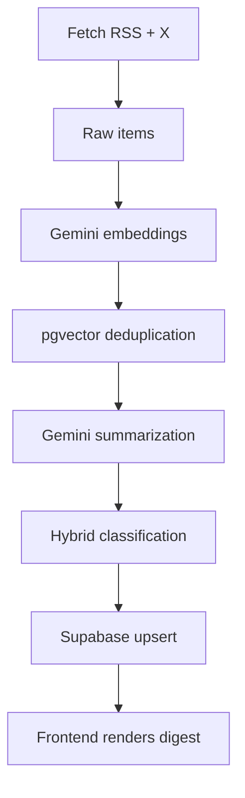

# ADR-002: Daily Digest Pipeline Architecture & Implementation

**Status:** Accepted
**Date:** 2026-03-25

## Context

`2min.today` must produce **one single daily edition** at 00:00 UTC that:
- ingests RSS feeds + X semantic streams,
- runs Gemini-powered summarization (`gemini-1.5-flash`),
- generates embeddings (`gemini-embedding-2-preview`),
- performs vector deduplication + cosine similarity,
- applies hybrid classification (Core 5 buckets + Emerging outliers < 0.65 similarity),
- stores results in Supabase for instant SvelteKit rendering.

All logic must live inside the **existing single-repo SvelteKit** codebase, run on **free Vercel + Supabase tier**, with **zero persistent workers** and **sub-2-second end-to-end latency**.

## Decision

**Single idempotent endpoint** at `/src/routes/api/digest/+server.ts` triggered by Vercel Cron.

The entire flow — fetch → embed → cluster → summarize → classify → upsert — executes in one job.
No separate services. No queues. No Docker.

### High-Level Data Flow



### Core 5 Buckets + Hybrid Classification

- Fixed buckets: `World` • `Tech` • `Economy` • `Science` • `Culture`
- Each cluster embedding compared (cosine) to 5 pre-embedded bucket anchors.
- ≥ 0.65 → assign to best bucket.
- < 0.65 → route to `Emerging`; Gemini generates one crisp category line.
- `Emerging` auto-archives after 24 h unless trend repeats.

### File Layout

```
/src
├── routes/api/digest/+server.ts          ← entire pipeline (entry point)
├── lib/pipeline/
│   ├── fetch.ts
│   ├── embed.ts
│   ├── cluster.ts
│   ├── summarize.ts
│   ├── classify.ts
│   └── upsert.ts
├── lib/types/digest.ts                   ← shared interfaces
└── supabase/migrations/001-pgvector.sql  ← schema + HNSW index
```

### Supabase Schema

```sql
create extension if not exists vector;

create table clusters (
  id uuid primary key default gen_random_uuid(),
  embedding vector(768),
  raw_items jsonb,
  summary jsonb,
  bucket text,
  category_line text,
  published_at timestamptz default now()
);

create index idx_clusters_embedding on clusters using hnsw (embedding vector_cosine_ops);
```

### Gemini Summarization Prompt

```ts
const SUMMARY_PROMPT = `
You are a brutalist news editor. Turn the cluster into:
1. One crisp headline (max 12 words)
2. Exactly 3 bullets (max 25 words each)
3. One "Why it Matters" sentence (max 30 words)

Tone: dense, zero fluff, future-facing. Sources attached separately.
`;
```

### Cron Trigger

```json
// vercel.json
{
  "crons": [{ "path": "/api/digest", "schedule": "0 0 * * *" }]
}
```

## Consequences

**Positive**
- One `git push` deploys the full daily engine.
- End-to-end latency < 2 s on free tier.
- Zero ops cost. Zero external dependencies beyond Gemini + Supabase.
- Matches Modern Brutalist constraints exactly (typography-first, zero images).

**Negative / Mitigations**
- Rate limits → batched calls + 60 s backoff.
- Cron overlap → idempotent key on `published_at` date.
- X quota → 24 h cache in Supabase.

**Alternatives Considered (and rejected)**
- Separate GitHub Actions worker → breaks single-repo cohesion.
- Real-time edge functions → unnecessary for daily digest.
- External vector DB (Pinecone) → violates $0 rule and adds latency.

## References

- ADR-001 (Backend Stack)
- Gemini Node SDK (embeddings + `generateContent`)
- Supabase pgvector cosine guide
- SvelteKit + Vercel Cron docs
- RFC-001 (exact implementation spec)

This ADR closes the architecture phase. Pipeline implementation can begin immediately.
