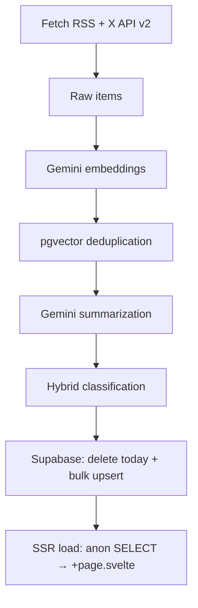

# ADR-002: Daily Digest Pipeline Architecture & Implementation

**Status:** Accepted
**Date:** 2026-03-25

## Context

`2min.today` must produce **one single daily edition** at 00:00 UTC that:
- ingests RSS feeds + X API v2 Recent Search tweets,
- runs Gemini-powered summarization (`gemini-2.5-flash`),
- generates embeddings (`gemini-embedding-2-preview`),
- performs vector deduplication + cosine similarity,
- applies hybrid classification (Core 5 buckets + Emerging outliers < 0.65 similarity),
- stores results in Supabase for instant SvelteKit rendering.

All logic must live inside the **existing single-repo SvelteKit** codebase, run on **free Vercel + Supabase tier**, with **zero persistent workers** and **sub-2-second end-to-end latency**.

RSS items are often **teasers only** (`<description>`, ~150–250 characters), not full articles. **`fetch.ts`** prefers full-body fields when present (`content:encoded`, Atom `content`, etc.), strips HTML, truncates to **800** characters, and passes that into `RawItem.content`. Quality stays strong because **clusters aggregate many sources plus X text**; Gemini synthesizes from the combined signal (RFC-001 §5 `fetch.ts`).

## Decision

**Single idempotent endpoint** at `/src/routes/api/digest/+server.ts` triggered by Vercel Cron.

The entire flow — fetch → embed → cluster → summarize → classify → upsert — executes in one job.
No separate services. No queues. No Docker.

### High-Level Data Flow



### Homepage read path (SSR)

- **`lib/supabase/client.ts`** — `createClient` with **`PUBLIC_SUPABASE_URL`** + **`PUBLIC_SUPABASE_ANON_KEY`** (`$env/dynamic/public`). Used by **`routes/+page.server.ts`** `load` to fetch today’s `clusters` rows; **no client-side fetch** for the digest list.
- **Query:** `SELECT id, bucket, category_line, summary, published_at` filtered with the **same UTC day range** as cron idempotency, ordered by `published_at` desc; results grouped by `bucket` for section rendering (replacing mock data).
- **RLS** on `clusters` must allow the anon role to read published digest rows. Full SQL and TypeScript are specified in RFC-001 §9.

### Core 5 Buckets + Hybrid Classification

- Fixed buckets: `World` • `Business` • `Tech` • `Science` • `Health` — same labels as the frontend digest UI (single source of truth: `lib/config/buckets.yaml`, loaded once via `lib/config/buckets.ts`; classify + seed script import `BUCKET_ANCHORS` from there only).
- **YAML dependency:** add the [`yaml`](https://www.npmjs.com/package/yaml) package only — on the order of **~4 KB gzipped**, **installed once**. The file is parsed when `buckets.ts` first loads; afterwards anchors are ordinary in-memory objects with **full TypeScript** types at call sites, so there is **no YAML work on the digest hot path** (clustering, Gemini, DB).
- YAML can evolve later (e.g. user-chosen topics or more sections) without splitting pipeline vs. product naming.
- Each cluster embedding compared (cosine) to 5 pre-embedded bucket anchors.
- ≥ 0.65 → assign to best bucket.
- < 0.65 → route to `Emerging`; Gemini generates one crisp category line.
- `Emerging` auto-archives after 24 h unless trend repeats.

### File Layout

```
/src
├── routes/+page.server.ts                ← SSR load: Supabase → grouped digest
├── routes/api/digest/+server.ts          ← entire pipeline (entry point)
├── lib/supabase/client.ts                ← anon client (public env; homepage read)
├── lib/supabase/server.ts                ← service role (pipeline / cron only)
├── lib/config/
│   ├── buckets.yaml                      ← bucket names + anchor text (single source of truth)
│   └── buckets.ts                        ← parses YAML; exports BUCKET_ANCHORS + Bucket type
├── lib/pipeline/
│   ├── index.ts          ← barrel: wires steps into pipeline.run(supabase)
│   ├── fetch.ts
│   ├── embed.ts
│   ├── cluster.ts
│   ├── summarize.ts
│   ├── classify.ts
│   └── upsert.ts
├── lib/types/digest.ts                   ← shared interfaces
└── supabase/migrations/001-pgvector.sql  ← schema + HNSW index
```

### Supabase Schema

```sql
create extension if not exists vector;

create table clusters (
  id uuid primary key default gen_random_uuid(),
  embedding vector(768),
  raw_items jsonb,
  summary jsonb,
  bucket text,
  category_line text,
  published_at timestamptz default now()
);

create index idx_clusters_embedding on clusters using hnsw (embedding vector_cosine_ops);

create table if not exists bucket_anchors (
  bucket    text primary key
    check (bucket in ('World', 'Business', 'Tech', 'Science', 'Health')),
  embedding vector(768) not null
);
-- Seeded once via scripts/seed-bucket-anchors.ts from BUCKET_ANCHORS in lib/config/buckets.ts (YAML-backed)
```

### Gemini summarization (structured JSON)

Summaries use **`gemini-2.5-flash`** with **`generationConfig.responseMimeType: 'application/json'`** and a **`responseSchema`** (`headline`, `bullets` length 3, `whyItMatters`) via `@google/generative-ai` — no free-form prose to parse. Prompt reinforces word limits; **`JSON.parse(response.text())`** only. Full snippet lives in RFC-001 §5 `summarize.ts`.

### Persistence (no partial daily rows)

Supabase JS does **not** rely on multi-statement Postgres transactions for the digest write. **`upsert.ts`** ends each successful run with **(1)** `DELETE` for today’s UTC `published_at` range, then **(2)** one **bulk `.upsert`** of the full classified set — **atomic for readers** (never a mixed old/new edition for the same day). If upsert fails after delete, that day’s window is empty until retry; idempotency allows a same-day re-run. Details in RFC-001 §5 `upsert.ts` and §10.

### Cron Trigger

```json
// vercel.json
{
  "crons": [{ "path": "/api/digest", "schedule": "0 0 * * *" }]
}
```

## Consequences

**Positive**
- One `git push` deploys the full daily engine.
- End-to-end latency < 2 s on free tier.
- Zero ops cost. Zero external dependencies beyond Gemini + Supabase.
- Matches Modern Brutalist constraints exactly (typography-first, zero images).
- Homepage stays **server-driven**: one `load`, digest data serialized to the page, no extra client round-trip for rows.

**Negative / Mitigations**
- Rate limits → batched calls + 60 s backoff.
- Cron overlap → idempotent key on `published_at` date.
- X API quota (10,000 tweets/month Basic tier) → ~20–40 items/day leaves ample headroom; cache last fetch timestamp in Supabase to avoid duplicate pulls.
- Secrets management → private keys in `apps/web/.env.example` + `.env.local` (gitignored); **`PUBLIC_` Supabase vars** for SSR reads documented alongside; same keys in Vercel.

**Alternatives Considered (and rejected)**
- Separate GitHub Actions worker → breaks single-repo cohesion.
- Real-time edge functions → unnecessary for daily digest.
- External vector DB (Pinecone) → violates $0 rule and adds latency.

## References

- ADR-001 (Backend Stack)
- Gemini Node SDK (embeddings, `generateContent`, structured JSON output)
- Supabase pgvector cosine guide
- SvelteKit + Vercel Cron docs
- RFC-001 (exact implementation spec)

This ADR closes the architecture phase. Pipeline implementation can begin immediately.
